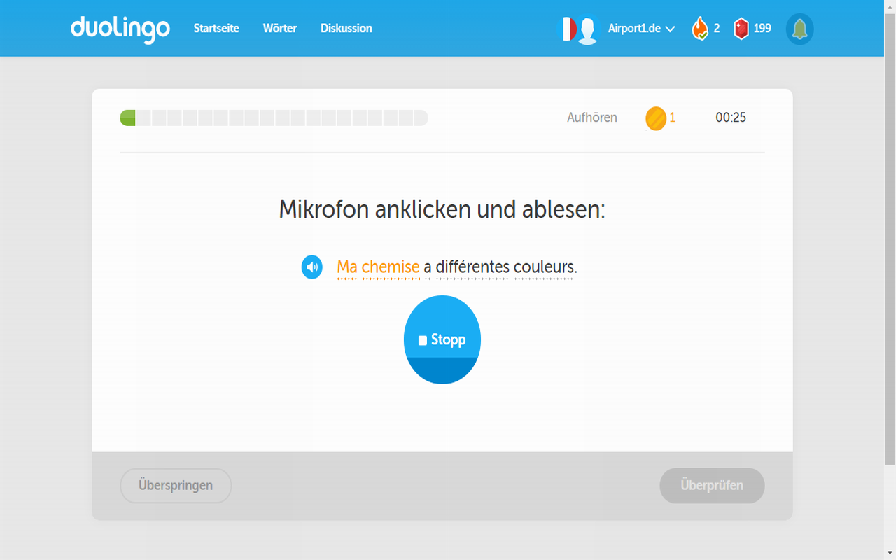

# Airport1 Duolingo Improvement

Simple and handy extension for Chromium browsers (like Chrome) to activate the microphone in [Duolingo] just by keyboard, 
instead of being forced to use the mouse ("please click the microphone"). 
This extension might become useless if Duolingo fixes this issue, but so far there is no reaction to do so.
This was just a self-teaching project by [Airport1] how to create an extension, but no more.

## Troubleshoot

Enable the extension first, then (re)load Duolingo. If it still not works, the markup might have changed?

## Hint

For multiple choice test use keys 1,2,3 and for dropdown use cursor keys in Duolingo skill tests.
To proceed use space bar or return key. No mouse is needed (anymore).

## Screenshot

## License
 
MIT

[Duolingo]: http://www.duolingo.com/
[Airport1]: http://www.airport1.de/